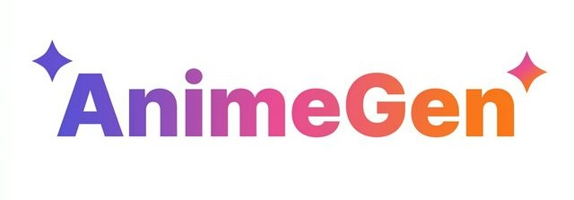
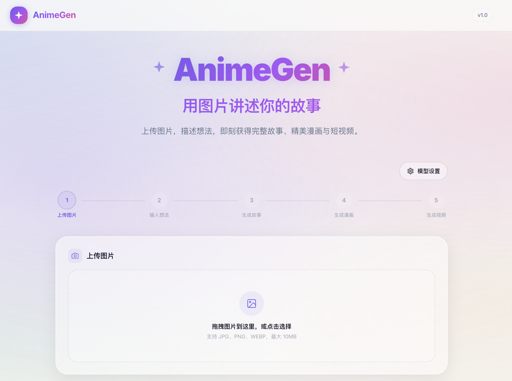

<div align="center">
  
  <br />
  <strong>Upload an image · Describe your idea · AI generates story, comics & video</strong>
  <br /><br />
  <a href="#quick-start"></a>
  <a href="#quick-start"></a>
  <a href="#quick-start"></a>
  <a href="#multi-provider-support"></a>
  <a href="#license"></a>
</div>

<br />

<div align="center">
  
</div>

<br />

## ✨ Features

| Feature | Description |
|---------|-------------|
| 🔍 **Image Analysis** | AI analyzes your photo — content, subjects, colors, mood & dynamics |
| 📖 **Story Generation** | Creates a 500–800 word narrative (beginning → development → climax → resolution) |
| 🎨 **Comic Generation** | Splits the story into 4 key scenes with style-consistent anime panel artwork |
| 🎬 **Video Generation** | *(optional)* Animates comic panels into a short video clip |

## 🔗 Pipeline

```
Upload Image ──▶ Vision Model ──▶ Text Model ──▶ Image Model ──▶ Video Model
                 (analyze)        (story)        (4 panels)      (optional)
```

## 🚀 Quick Start

**1. Install dependencies**

```bash
bun install
```

**2. Configure API key**

Create a `.env.local` file in the project root:

```env
ZHIPU_API_KEY=your_zhipu_api_key
```

**3. Start dev server**

```bash
bun run dev
```

Then open **[http://localhost:3000](http://localhost:3000)** 🎉

## 🤖 Default Models

| Task | Model | Provider |
|------|-------|----------|
| Vision | `glm-4v-flash` | Zhipu AI |
| Text | `glm-4-flash` | Zhipu AI |
| Image | `cogview-3-flash` | Zhipu AI |
| Video | `cogvideox-flash` | Zhipu AI |

All models can be changed per-task in the **Settings** panel (⚙️ button).

## 🌐 Multi-Provider Support

Configure each generation step independently — mix and match providers:

| Provider | Models | Auth |
|----------|--------|------|
| **Zhipu AI** *(default)* | GLM-4V, GLM-4, CogView-3, CogVideoX | `ZHIPU_API_KEY` |
| **OpenAI** | GPT-4o, DALL-E 3, Sora | `OPENAI_API_KEY` |
| **Anthropic** | Claude 3.5 Sonnet, Claude 3 Haiku | `ANTHROPIC_API_KEY` |
| **Custom** | Any OpenAI-compatible endpoint | In-app config |

> 💡 For custom endpoints, enter the base URL, model name, and API key directly in the UI settings.

## 📁 Project Structure

```
app/
├── api/                      # Server-side API routes
│   ├── upload/               # Image upload & validation
│   ├── analyze/              # Vision model — image analysis
│   ├── story/                # Text model — story generation
│   ├── comics/               # Image model — comic panel generation
│   └── video/                # Video model — clip generation
├── page.tsx                  # Main dashboard
└── results/[sessionId]/      # Results showcase page

components/
├── generation/               # Pipeline, StepIndicator, StoryDisplay, ComicStrip, VideoPlayer
├── ui/                       # Button, Card, Spinner, ModelSelector
└── upload/                   # ImageUploader (drag & drop)

lib/
├── ai/                       # AI service layer
│   ├── client.ts             # Multi-provider HTTP client (axios)
│   ├── analyze.ts            # Image → structured analysis
│   ├── generateStory.ts      # Analysis + idea → narrative
│   ├── generateComics.ts     # Story → 4 scene extraction → panel art
│   └── generateVideo.ts      # Panel → video (async polling)
├── models.ts                 # Provider & model definitions
└── store/                    # React Context state management
```

## 🏗️ Build & Deploy

```bash
# Production build
bun run build

# Start production server
bun run start
```

## ❓ Troubleshooting

| Problem | Solution |
|---------|----------|
| Generation fails immediately | Verify API key is valid and has remaining quota |
| Upload fails | Ensure file is JPG, PNG, or WEBP and under 10 MB |
| Styles look broken | Run `bun run build` → `bun run start` instead of dev |
| `.env.local` changes ignored | Restart the dev server |

## 📄 License

[MIT](LICENSE)